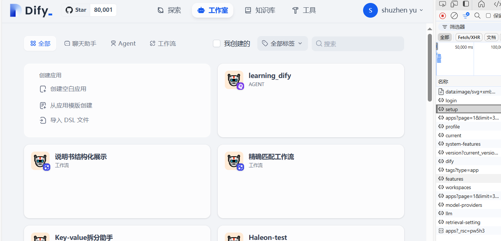

今天我们要学习的源码部分：

通过Dify的登录界面，学习

第一个接口：Dify\api\controllers\console\login.py

其中包括了LoginApi、LogoutApi、ResetPasswordSendEmailApi、EmailCodeLoginSendEmailApi、EmailCodeLoginApi、RefreshTokenApi

提供了登录、登出、发送邮件验证码、处理验证码请求登录等功能

作者觉得比较有亮点的配置在于通过了登录的速率限制和令牌验证机制防止了恶意攻击

第二个接口：Dify\api\controllers\console\setup.py

由于该接口并未涉及其他功能，所以我就大概介绍一下，setup.py主要提供了对于dify用户信息的初始化配置，提供默认的参数配置，提供验证身份的功能

第三个接口：Dify\api\controllers\console\app\AppListApi

该接口通过get方法，传入分页参数，功能是展示当前dify创建的各个工作流应用

第四个接口：Dify\api\controllers\console\workspace\model_providers

该接口提供了当前用户所有配置的模型提供商信息

第五个接口：http://51azure.tpddns.cn:9097/console/api/workspaces/current/models/model-types/llm

请求当前所有配置的llm模型信息

总的来说，Dify的初始界面主要是提供了一些简单方法，例如登录、验证、找到所有模型的信息等

感兴趣的读者也可自行登录，通过f12调试工具来看每一个界面涉及到的api请求以及传入的参数和输出的参数

