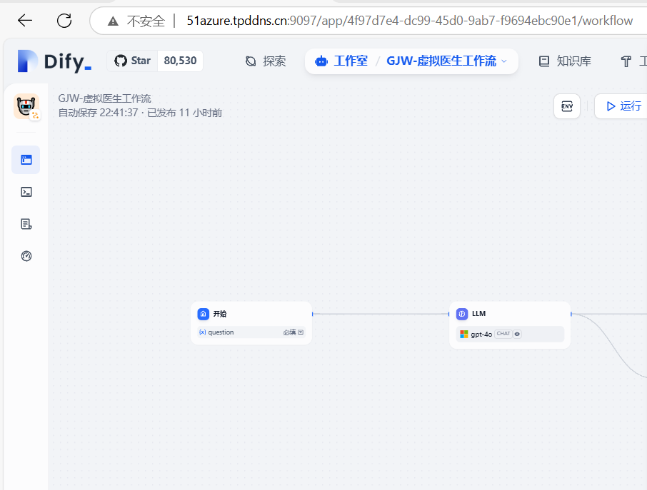

今天我们要学习的源码部分：



进入工作流面板，除开默认创建的LLM模型和系统配置，当我们增加一个节点，会调用Draft接口，创建一个新的节点

找到workflow.py (controller\console\app\workflow)

查找和新增都是在Dify自带的数据库中进行搜索，具体的细节类似于crud

我们主要看一下：

```python
class DraftWorkflowRunApi(Resource):
    @setup_required
    @login_required
    @account_initialization_required
    @get_app_model(mode=[AppMode.WORKFLOW])
    def post(self, app_model: App):
        """
        Run draft workflow
        """
        # The role of the current user in the ta table must be admin, owner, or editor
        if not current_user.is_editor:
            raise Forbidden()

        if not isinstance(current_user, Account):
            raise Forbidden()

        parser = reqparse.RequestParser()
        parser.add_argument("inputs", type=dict, required=True, nullable=False, location="json")
        parser.add_argument("files", type=list, required=False, location="json")
        args = parser.parse_args()

        response = AppGenerateService.generate(
            app_model=app_model,
            user=current_user,
            args=args,
            invoke_from=InvokeFrom.DEBUGGER,
            streaming=True,
        )

        return helper.compact_generate_response(response)
```

这个执行run方法的关键在于 AppGenerateService.generate 我们继续往下看

```python
def generate(
    cls,
    app_model: App,
    user: Union[Account, EndUser],
    args: Mapping[str, Any],
    invoke_from: InvokeFrom,
    streaming: bool = True,
):
    """
    App Content Generate
    :param app_model: app model
    :param user: user
    :param args: args
    :param invoke_from: invoke from
    :param streaming: streaming
    :return:
    """
    max_active_request = AppGenerateService._get_max_active_requests(app_model)
    rate_limit = RateLimit(app_model.id, max_active_request)
    request_id = RateLimit.gen_request_key()
    try:
        request_id = rate_limit.enter(request_id)
        if app_model.mode == AppMode.COMPLETION.value:
            return rate_limit.generate(
                CompletionAppGenerator.convert_to_event_stream(
                    CompletionAppGenerator().generate(
                        app_model=app_model, user=user, args=args, invoke_from=invoke_from, streaming=streaming
                    ),
                ),
                request_id=request_id,
            )
        elif app_model.mode == AppMode.AGENT_CHAT.value or app_model.is_agent:
            return rate_limit.generate(
                AgentChatAppGenerator.convert_to_event_stream(
                    AgentChatAppGenerator().generate(
                        app_model=app_model, user=user, args=args, invoke_from=invoke_from, streaming=streaming
                    ),
                ),
                request_id,
            )
        elif app_model.mode == AppMode.CHAT.value:
            return rate_limit.generate(
                ChatAppGenerator.convert_to_event_stream(
                    ChatAppGenerator().generate(
                        app_model=app_model, user=user, args=args, invoke_from=invoke_from, streaming=streaming
                    ),
                ),
                request_id=request_id,
            )
        elif app_model.mode == AppMode.ADVANCED_CHAT.value:
            workflow = cls._get_workflow(app_model, invoke_from)
            return rate_limit.generate(
                AdvancedChatAppGenerator.convert_to_event_stream(
                    AdvancedChatAppGenerator().generate(
                        app_model=app_model,
                        workflow=workflow,
                        user=user,
                        args=args,
                        invoke_from=invoke_from,
                        streaming=streaming,
                    ),
                ),
                request_id=request_id,
            )
        elif app_model.mode == AppMode.WORKFLOW.value:
            workflow = cls._get_workflow(app_model, invoke_from)
            return rate_limit.generate(
                WorkflowAppGenerator.convert_to_event_stream(
                    WorkflowAppGenerator().generate(
                        app_model=app_model,
                        workflow=workflow,
                        user=user,
                        args=args,
                        invoke_from=invoke_from,
                        streaming=streaming,
                        call_depth=0,
                        workflow_thread_pool_id=None,
                    ),
                ),
                request_id,
            )
        else:
            raise ValueError(f"Invalid app mode {app_model.mode}")
    except RateLimitError as e:
        raise InvokeRateLimitError(str(e))
    except Exception:
        rate_limit.exit(request_id)
        raise
    finally:
        if not streaming:
            rate_limit.exit(request_id)
```

这个方法首先我认为有几个特色

第一个：是根据传入的App 来判断属于工作流、chatflow等功能的具体哪个功能，根据if作为筛选条件进行判断

第二个：添加了速率限制器

```python
rate_limit = RateLimit(app_model.id, max_active_request)
request_id = RateLimit.gen_request_key()
```

因为本期主要是看工作流的运行，所以我们定位到有关workflow的地方

```python
workflow = cls._get_workflow(app_model, invoke_from)
            return rate_limit.generate(
                WorkflowAppGenerator.convert_to_event_stream(
                    WorkflowAppGenerator().generate(
                        app_model=app_model,
                        workflow=workflow,
                        user=user,
                        args=args,
                        invoke_from=invoke_from,
                        streaming=streaming,
                        call_depth=0,
                        workflow_thread_pool_id=None,
                    ),
                ),
                request_id,
            )
```

首先我们来分析cls._get_workflow(app_model, invoke_from)

这是一个类方法，本质上是通过if判断当前工作流是测试工作流还是发布工作流

```python
def _get_workflow(cls, app_model: App, invoke_from: InvokeFrom) -> Workflow:
    """
    Get workflow
    :param app_model: app model
    :param invoke_from: invoke from
    :return:
    """
    workflow_service = WorkflowService()
    if invoke_from == InvokeFrom.DEBUGGER:
        # fetch draft workflow by app_model
        workflow = workflow_service.get_draft_workflow(app_model=app_model)

        if not workflow:
            raise ValueError("Workflow not initialized")
    else:
        # fetch published workflow by app_model
        workflow = workflow_service.get_published_workflow(app_model=app_model)

        if not workflow:
            raise ValueError("Workflow not published")

    return workflow
```

这里我们再看workflow_service.get_draft_workflow(app_model=app_model)

定位到service\workflow_service 找到get_draft_workflow 这个函数是返回一个具体的workflow对象

通过租户id与当前的模型id返回最近的一个（其实还有疑问，当dify不发布的时候，暂存的工作流是通过缓存还是也存到了数据库，这个地方要存疑）？？？ 等待后续的源码解析，继续解析


Workflow类解析：位置model/workflow 

数据存储: 使用 SQLAlchemy 定义表结构，支持多种字段类型。
属性封装: 提供多个属性方法，简化复杂数据的处理（如 JSON 解析、哈希生成等）。
安全性: 对敏感变量进行加密/解密处理，确保数据安全。
扩展性: 支持旧版结构到新版结构的转换，便于兼容性维护。

个人认为的要点：每一个类存储后，都会生成一个工作流的唯一哈希值用于调用，其他就是正常的方法


由于本人工作原因，将分为两期来详细讲解Dify工作流的run方法

目前看到后面，一个run方法涉及到非常多的逻辑，调用了好几个generate方法，属实有点绕晕。

下一期将带来详细的解析，旨在弄明白一个run到底有哪些逻辑，当我们的dify遇到问题，我们可以怎么修改我们的逻辑

我是Harry，一个刚毕业的小白，对于代码有着十足的热爱，热衷于把自己学习的知识和内容分享出来

